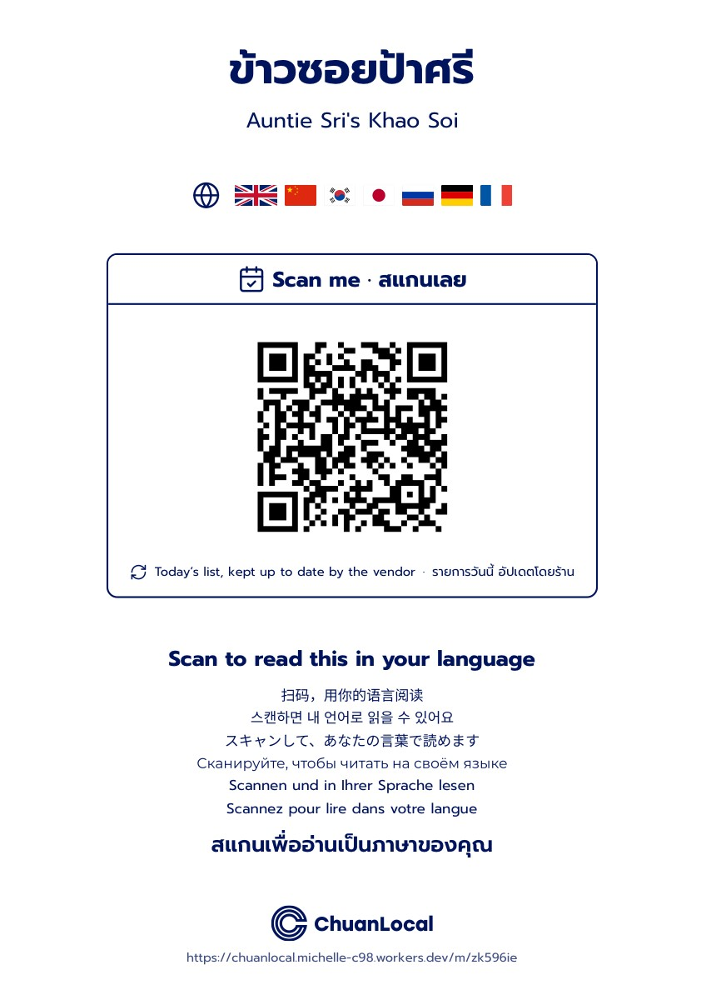

# ChuanLocal

Thai vendors write their list in Thai. Visitors scan one QR sign and read it in their own language.

*ชวน (chuan) means "to invite." Every sign is an invitation.*

Built at Claude Impact Lab Chiang Mai, 26 and 27 September 2026.

## Links

| What | Link |
|---|---|
| Home page | https://chuanlocal.michelle-c98.workers.dev |
| App (vendor start) | https://chuanlocal.michelle-c98.workers.dev/start |
| Vendor guide | https://chuanlocal.michelle-c98.workers.dev/get-started |
| Example visitor list | https://chuanlocal.michelle-c98.workers.dev/m/zk596ie?lang=en |
| Slides | https://chuanlocal.michelle-c98.workers.dev/slides/ |
| Vendor sign (PDF) | [docs/sign-example.pdf](docs/sign-example.pdf) |
| Brand strategy | https://claude.ai/artifact/PCEmqXWD7JxDL1Dpo7bUhw |
| Brand guidelines | https://claude.ai/artifact/UagKf1AkYv8sPSpdvJj21q |
| Design system | https://claude.ai/artifact/43v13nBZYCSP4b25bMiRTL (tokens in [`design-system/`](design-system)) |

## The vendor sign

[](docs/sign-example.pdf)

## What we built

- **For vendors:** a Thai web page. Type the shop name, add items in Thai, mark today's special, print the QR sign. No app. No account. Each shop gets a private edit link.
- **For visitors:** scan the sign. The list opens in the phone's language, with the Thai under every item to point at.
- **The sign:** one A4 page in one dark ink on white, so it prints cheaply on any printer. Flags and a globe show that the list comes in your language.
- **The home page:** tells the story in 8 languages. It is written mainly for local Thai vendors.

## Why

Visitors can't read Thai-only signs. So they point, guess or walk past. The vendor never sees the sale they lost. A lost sale looks like a quiet day.

## Rationale

- **The vendor never leaves Thai.** The Thai stays the source. Translation sits beside it and never replaces it.
- **No install, no login.** Street vendors won't download an app or manage a password. A link and a printed sign are enough.
- **Translate once, on save.** Cloudflare Workers AI (SEA-LION) translates when the vendor saves. The result is stored, so visitors load fast and scanning costs nothing.
- **If a translation is odd, the Thai still works.** Visitors can show the Thai name to order.
- **Free for vendors and visitors.** Built to help Chiang Mai, not to make money.
- **One design system.** Every colour, size and space comes from the tokens, so the app, home page, sign and slides match the brand guide.

## Stack

Cloudflare Workers and Hono, D1 (SQLite), Workers AI, and `qrcode` for the SVG sign.

## Develop

```bash
npm install
npm run db:migrate:local
npx wrangler dev          # AI calls need a Cloudflare login or CLOUDFLARE_API_TOKEN
```

## Deploy

```bash
npm run db:migrate        # apply migrations to the remote D1 database
npm run deploy
```

## Routes

| Route | Who | What |
|---|---|---|
| `/` | everyone | Home page (`?lang=xx` for th, en, ko, zh, ja, es, fr, de) |
| `/get-started` | vendor | How to get started |
| `/start` | vendor | Create a shop (type and name) |
| `/edit/:secret` | vendor | Edit items, set today's special, mark sold out, save and translate |
| `/sign/:secret` | vendor | Printable A4 QR sign |
| `/m/:slug` | visitor | Translated list (`?lang=xx` to force a language) |
| `/slides/` | presenter | Demo slides |
